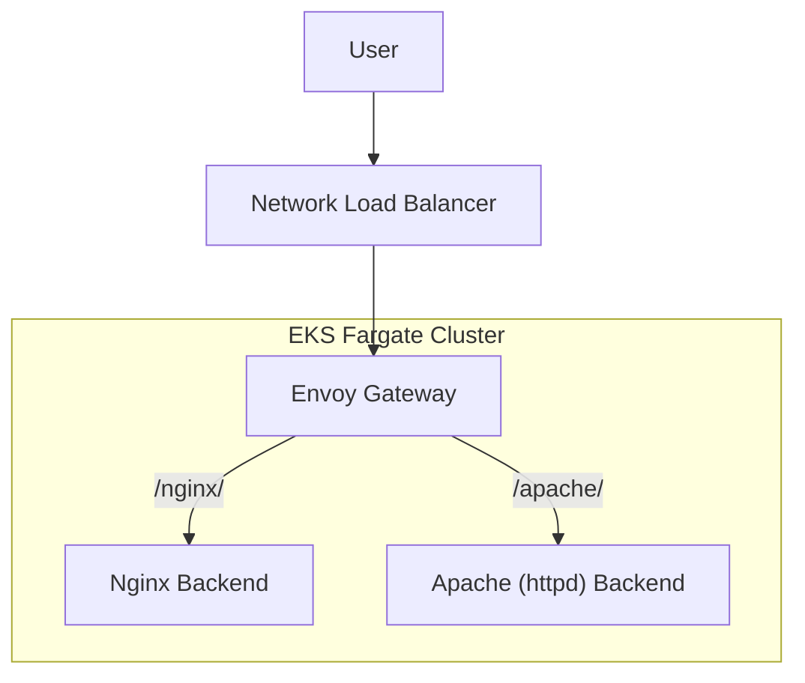

Managing ingress in a fully serverless Kubernetes environment like **EKS on Fargate** comes with unique challenges. Most popular ingress controllers — such as **NGINX Ingress** and **Traefik** — assume access to traditional node groups or DaemonSets, making them difficult to run purely on Fargate.

After exploring multiple options and running into many issues with existing controllers, I turned to **Envoy Gateway** — a modern, flexible, and CNCF-supported solution that fits the constraints of a **Fargate-only environment**.

While there is plenty of documentation on running Envoy Gateway on EKS, most of it assumes a standard EKS setup with **EC2 node groups**. Unfortunately, these guides often miss the nuances and limitations specific to **EKS Fargate**, such as how to configure:

- **Networking**
- **Service types**
- **Resource scheduling**

This tutorial is a **practical guide** based on a combination of:

- Official documentation
- Community tutorials
- A fair amount of personal **trial and error**

If you're looking to run **Envoy Gateway fully on EKS Fargate** — *without provisioning any EC2 nodes* — this guide is for you.

By default, when deploying Envoy Gateway in EKS using a Service of type LoadBalancer, AWS will provision a Classic Load Balancer (CLB). This behavior is automatic unless you have the AWS Load Balancer Controller installed and configured.

The problem? Classic Load Balancers are outdated and come with serious limitations. In fact, even AWS does not recommend deploying CLBs inside VPC-oriented networks anymore.

In a Fargate-only cluster, where running DaemonSets or manually managing node ports is not an option, you need a way to expose Envoy Gateway efficiently and securely at Layer 7. This is where the AWS Load Balancer Controller comes in.

Our goal is to build a fully serverless ingress stack—using Envoy Gateway on Fargate, with a single external load balancer and path-based routing to backend services—all without EC2 nodes:
A User sends a request that hits an external Network Load Balancer (NLB).
- The NLB forwards traffic to the Envoy Gateway, which is running inside the EKS Fargate cluster.
- Envoy Gateway acts as the ingress proxy, routing requests based on path prefixes:
- Requests to /nginx/ are forwarded to the Nginx backend pod.
-   Requests to /apache/ are forwarded to the Apache (httpd) backend pod.



---
First, lets deploy an EKS cluster using eksctl.

Create the eksctl-config.yaml file with the following content. Feel free to change the region and Kubernetes version as needed.

```yaml
apiVersion: eksctl.io/v1alpha5
kind: ClusterConfig
metadata:
  name: envoy-demo
  region: us-west-2
  version: "1.32"
iam:
  withOIDC: true
fargateProfiles:
  - name: fp-default
    selectors:
      - namespace: default
  - name: fp-kube-system
    selectors:
      - namespace: kube-system
  - name: fp-envoy-gateway-system
    selectors:
      - namespace: envoy-gateway-system
addons:
- name: vpc-cni
- name: coredns
- name: kube-proxy
- name: eks-pod-identity-agent
```

We will use the "envoy-gateway-system" namespace to deploy the Envoy Gateway controller, "kube-system" to deploy the AWS ALB Ingress Controller, and "default" to deploy our backend application.

Lets deploy the EKS cluster.

```shell
$ eksctl create cluster -f eksctl-config.yaml
```

Creating the EKS cluster will typically take around 15 minutes to complete.

Now, proceed to install Envoy Gateway.

```shell
$ helm install eg oci://docker.io/envoyproxy/gateway-helm --version v1.4.1 --namespace envoy-gateway-system --create-namespace
```

Verify that the Envoy Gateway pod is in the Running state by executing the following command:

```shell
$ kubectl get pods --namespace envoy-gateway-system
NAME                             READY   STATUS    RESTARTS   AGE
envoy-gateway-7c88d4fff4-77qft   1/1     Running   0          2m6s
```

Now it's time to create our first Envoy Gateway resources. Save the following configuration to a file named proxy.yaml, then apply it to your cluster.

```yaml
apiVersion: gateway.networking.k8s.io/v1
kind: GatewayClass
metadata:
  name: eg
spec:
  controllerName: gateway.envoyproxy.io/gatewayclass-controller
  parametersRef:
    group: gateway.envoyproxy.io
    kind: EnvoyProxy
    namespace: envoy-gateway-system
    name: envoy-proxy
---
apiVersion: gateway.envoyproxy.io/v1alpha1
kind: EnvoyProxy
metadata:
  name: envoy-proxy
  namespace: envoy-gateway-system
spec:
  provider:
    type: Kubernetes
    kubernetes:
      envoyService:
        annotations:
          service.beta.kubernetes.io/aws-load-balancer-type: "external"
          service.beta.kubernetes.io/aws-load-balancer-nlb-target-type: "ip"
          service.beta.kubernetes.io/aws-load-balancer-scheme: "internet-facing"
```

Notice the "IP" NLB target type. Because we use Fargate, the default "INSTANCE" target group type will not work, because Fargate pods are not bound to EC2 instances. Unlike traditional nodes, Fargate runs pods directly on managed infrastructure, so there are no instance IDs to register with the load balancer. Instead, you must use the IP target type, which allows the NLB to route traffic directly to the pod IPs running on Fargate.

```shell
$ kubectl apply -f proxy.yaml
```

Now we need to create an IAM policy that will later be used to create a service account inside Kubernetes for the AWS Load Balancer Controller.

Some examples online miss the "elasticloadbalancing:DescribeTargetGroupAttributes" action, which is critical for this solution to work. Without it, you may find that no target groups are registered after creating HTTPRoutes.

Download the content of this Gist and save it as alb_iam_policy.json.

```shell
$ curl https://gist.githubusercontent.com/safety2nd/47a91d7121e53deaef1e9d7bc050de94/raw/e5024148f1eec4023075e68dac0c110ffacb6617/gistfile1.txt -o alb_iam_policy.json
```

Create the IAM policy called "AWSLoadBalancerControllerIAMPolicy".

```shell
$ aws iam create-policy --policy-name AWSLoadBalancerControllerIAMPolicy --policy-document file://alb_iam_policy.json
```

It's time to create a service account in your Kubernetes cluster that will be linked to the IAM policy we just created.

```shell
$ eksctl create iamserviceaccount \
  --cluster=envoy-demo \
  --namespace=kube-system \
  --name=aws-load-balancer-controller \
  --role-name AmazonEKSLoadBalancerControllerRole \
  --attach-policy-arn=arn:aws:iam::<REPLACE_WITH_YOUR_AWS_ACCOUNT_ID>:policy/AWSLoadBalancerControllerIAMPolicy \
  --approve
```

Now, let's deploy the AWS Load Balancer Controller to your cluster.

```shell
$ helm install aws-load-balancer-controller eks/aws-load-balancer-controller \
  --namespace kube-system \
  --set clusterName=envoy-demo \
  --set serviceAccount.create=false \
  --set serviceAccount.name=aws-load-balancer-controller \
  --set region=us-west-2 \
  --set vpcId=<REPLACE_WITH_YOUR_VPC_ID>
```

Wait until the AWS Load Balancer Controller pods show a status of Running by checking with:

```shell
$ kubectl get pods --namespace kube-system | grep aws
aws-load-balancer-controller-678d6d7d47-5p28h   0/1     Running   0          53s
aws-load-balancer-controller-678d6d7d47-7zzhj   0/1     Running   0          53s
```

There is one more resource we need to deploy before creating routes - the Gateway. Save the following configuration as gateway.yaml and deploy it to your cluster.
apiVersion:

```yaml
apiVersion: gateway.networking.k8s.io/v1
kind: Gateway
metadata:
  name: apps
spec:
  gatewayClassName: eg
  listeners:
    - name: http
      protocol: HTTP
      port: 80
```

```shell
$ kubectl apply -f gateway.yaml
```

Let's create HTTP routes to instruct our Envoy Gateway on how to handle incoming traffic. Save the following snippet as routes.yaml and deploy it to your cluster.

```yaml
apiVersion: gateway.networking.k8s.io/v1
kind: HTTPRoute
metadata:
  name: nginx
spec:
  parentRefs:
    - group: gateway.networking.k8s.io
      kind: Gateway
      name: apps
  rules:
    - matches:
        - path:
            type: PathPrefix
            value: /nginx/
      filters:
        - type: URLRewrite
          urlRewrite:
            path:
              type: ReplacePrefixMatch
              replacePrefixMatch: /
      backendRefs:
        - group: ""
          kind: Service
          name: nginx
          port: 80
          weight: 1
---
apiVersion: gateway.networking.k8s.io/v1
kind: HTTPRoute
metadata:
  name: apache
spec:
  parentRefs:
    - group: gateway.networking.k8s.io
      kind: Gateway
      name: apps
  rules:
    - matches:
        - path:
            type: PathPrefix
            value: /apache/
      filters:
        - type: URLRewrite
          urlRewrite:
            path:
              type: ReplacePrefixMatch
              replacePrefixMatch: /
      backendRefs:
        - group: ""
          kind: Service
          name: apache
          port: 80
          weight: 1
```

You can verify that the routes have been created correctly by running:

```shell
$ kubectl get httproutes
NAME     HOSTNAMES   AGE
apache               12s
nginx                12s
```

It's time to run our backend servers. Save the following snippet as backend.yaml and deploy it to your cluster.

```yaml
apiVersion: v1
kind: ServiceAccount
metadata:
  name: nginx
---
apiVersion: v1
kind: ServiceAccount
metadata:
  name: apache
---
apiVersion: v1
kind: Service
metadata:
  name: nginx
  labels:
    app: nginx
    service: nginx
spec:
  ports:
  - name: http
    port: 80
    targetPort: 80
  selector:
    app: nginx
---
apiVersion: v1
kind: Service
metadata:
  name: apache
  labels:
    app: apache
    service: apache
spec:
  ports:
  - name: http
    port: 80
    targetPort: 80
  selector:
    app: apache
---
apiVersion: apps/v1
kind: Deployment
metadata:
  name: nginx
spec:
  replicas: 1
  selector:
    matchLabels:
      app: nginx
  template:
    metadata:
      labels:
        app: nginx
    spec:
      serviceAccountName: nginx
      containers:
      - image: nginx:latest
        imagePullPolicy: IfNotPresent
        name: nginx
        ports:
        - containerPort: 80
---
apiVersion: apps/v1
kind: Deployment
metadata:
  name: apache
spec:
  replicas: 1
  selector:
    matchLabels:
      app: apache
  template:
    metadata:
      labels:
        app: apache
    spec:
      serviceAccountName: apache
      containers:
      - image: httpd:latest
        imagePullPolicy: IfNotPresent
        name: nginx
        ports:
        - containerPort: 80
```

```shell
$ kubectl apply -f backend.yaml
```

Let's check the current status. First, confirm that our backend applications are running correctly by running:

```shell
$ kubectl get pods
NAME                      READY   STATUS    RESTARTS   AGE
apache-5d48fd7479-s6jx5   1/1     Running   0          2m
nginx-77fc6c9f79-rvwzh    1/1     Running   0          2m
```

Inside AWS, you should see a new Application Load Balancer (ALB) being provisioned with an IP-based Target Group attached. This Target Group should have exactly one target registered - corresponding to your backend pod's IP address.


If we hadn't used Envoy Gateway and relied solely on the AWS Load Balancer Controller, we would have ended up with two separate load balancers instead of one. Since each load balancer costs about $16/month, this might not be a big deal for just a few exposed routes. However, if you plan to have hundreds or thousands of routes, these costs can quickly add up.

Now, let's verify if our applications are working correctly. Grab the load balancer's DNS name from the AWS console, then try accessing your services by appending /nginx/ and /apache/ to the URLs.


Works perfectly! As you can see, deploying a scalable ingress controller on a Fargate-only EKS cluster is no longer as difficult as it used to be.

But what if something goes wrong?

Remember to follow all instructions in the exact order provided here. If issues arise, check the logs of the aws-load-balancer-controller and envoy-gateway pods to diagnose the problem.

Sources used:
- https://eksctl.io/usage/fargate-support/
- https://tetrate.io/blog/envoy-gateway-with-aws-nlb
- https://gateway.envoyproxy.io/latest/tasks/quickstart/
- https://kubernetes-sigs.github.io/aws-load-balancer-controller/latest/deploy/installation/